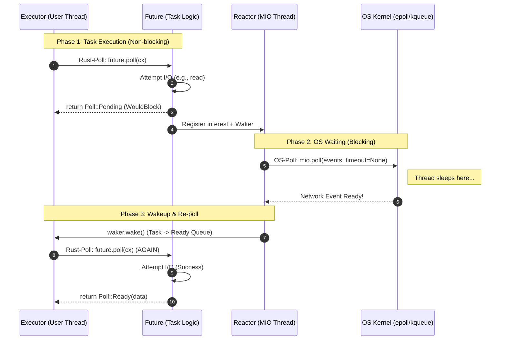
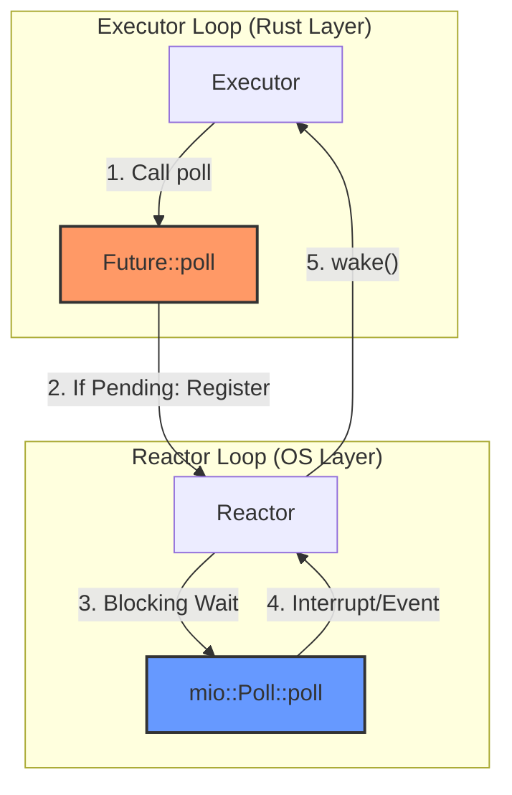

# Mini Rust Runtime Architecture

This document visualizes the internal logic and workflow of the custom async runtime implemented in `mini_runtime.rs`, with a focus on distinguishing between the two types of "Poll".

## 1. Comparison: Rust Poll vs. OS Poll

It's critical to distinguish between these two different "Poll" mechanisms:

| Feature | Rust `Future::poll` | OS `mio::Poll::poll` |
| :--- | :--- | :--- |
| **Location** | `Executor` calling the `Task` | `Reactor` calling the OS Kernel |
| **Purpose** | Check if a task can make progress | Wait for *any* external I/O events |
| **Blocking** | **Non-blocking**. Must return quickly. | **Blocking**. Sleeps until events occur. |
| **Output** | `Ready(T)` or `Pending` | A list of ready `Events` |
| **Trigger** | Triggered by a `Waker` notification | Triggered by hardware/network activity |

---

## 2. Refined Sequence Diagram

This diagram separates the **Runtime-level Polling** from the **OS-level Polling**.

## 3. Component Interaction Map

## 3. Component Details

- **Executor**: The engine that drives the execution. It continuously pops ready tasks from a queue and calls `poll` on them.
- **Reactor**: A background thread running `mio::Poll`. It monitors OS events and uses `Waker` to tell the Executor which tasks are ready to progress.
- **Task**: A wrapper around a pinned `Future` and a way to re-schedule itself via the `ready_queue`.
- **Waker**: The bridge between the Reactor and Executor. When the Reactor sees an event, it calls `wake()`, which puts the Task back into the Executor's queue.
